
<!--
*** Thanks for checking out the project. If you have a suggestion that would make this better, please fork the repo and create a pull request
*** Don't forget to give the project a star!
*** Thanks again!
-->
<!-- TABLE OF CONTENTS -->

  
Table of Contents

  <ol>
    <li>
      <a href="#about-the-project">About The Project</a>
      <ul>
        <li><a href="#built-with">Built With</a></li>
      </ul>
    </li>
    <li>
      <a href="#getting-started">Getting Started</a>
      <ul>
        <li><a href="#requirements">Requirements</a></li>
        <li><a href="#installation">Installation</a></li>
      </ul>
    </li>
    <li><a href="#usage">Usage</a></li>
    <li><a href="#demo">Demo</a>
      <detail>
        <ul>
          <li><a href="#demo">Demo Login</a></li>
          <li><a href="#demo-home-page">Home Page</a></li>         
          <li><a href="#demo-approves-and-rejects-product">Approves and Rejects Product</a></li>     
          <li><a href="#demo-product-bidding">Product Bidding</a></li>
          <li><a href="#demo-payment">Payment</a></li>
          <li><a href="#demo-search-product">Search product</a></li>
          <li><a href="#demo-email-notifications">Email notifications</a></li>
        </ul>
      </detail></li>
    <li><a href="#license">License</a></li>
  </ol>

<!-- ABOUT THE PROJECT -->
## About The Project
Project: Online Auction System (OAS) 
Part 1: Source Code back-end. 
**Part 2: Source Code front-end**. 
This is the second part of the project.
The system supports users to participate in online product auctions. 
Users can post products for auction. 
Users can also participate in product auctions. 
After successfully bidding on the product, users can make online payments on the system.

(<a href="#readme-top">back to top</a>)

### Built With
The project is built based on the following frameworks/libraries:
* 
* 
* 
* 
* 
* 
* 
* 
* 
* 
* 
* 
* 
* 

(<a href="#readme-top">back to top</a>)

<!-- GETTING STARTED -->
## Getting Started
To get a local copy up and running follow these steps.

(<a href="#readme-top">back to top</a>)

### Requirements
Before you continue, ensure you meet the following requirements:
* MS SQL Server, Version = 2022
* dotNet, Version = 6.0
* Redis, Version = 3.0.504
* SignalR, Version = 6.0.21
* Account VNPAY
* AWS IAM Account or Root Account
* Hangfire Core, Version = 1.8.5.0
* Gmail Account
* OS: Windows

(<a href="#readme-top">back to top</a>)

### Installation
I am deploying the system on Docker but it is not yet completed, in the meantime you can install the system and components manually as follows:
* First you need to install dotNet 6.0 or later.
* After installation, next you install MS SQL Server version 2022 or later.
* You can install an IDE to code C# such as Visual Studio or another IDE, my project uses Visual Studio 2022.
* Install Redis version = 3.0.504 or later.
* Next, you can Clone the source code or Download the Zip file project OAS.FE.
* **Note**: This project only contains the front-end source code of the project, if you need the full project, you need to install the OAS.BE project in my github. I have a pin on my github homepage or you can refer to it [**here**](https://github.com/btnhutdev/OAS.BE)
* You also need to customize information such as AWS account, Email Configuration, Connection Strings, JWT Token,... in the following projects:
* Next register an account at VNPAY Payment Gateway. ([**Register**](https://sandbox.vnpayment.vn/devreg) a free account in dev/test environment).  
* You also need to customize information such as AWS account, Email Configuration, Connection Strings, JWT Token,... in the following projects:
  * Admin\appsettings.json file
  * Auctioneer\appsettings.json file
  * Bidder\appsettings.json file 
* Install AWS CLI version 2 and log in with your AWS account, making sure your account has permission to access the S3 bucket.
* **Note**: Some of the installation steps you performed when installing the OAS.BE project can be skipped.

(<a href="#readme-top">back to top</a>)

<!-- USAGE -->
## Usage
* Right-click Solution in the Solution Explorer window, select Properties, select Multiple startup projects. Select action start for projects:
  * Admin
  * Auctioneer
  * Bidder
* You can run the project in local by clicking Start in Visual Studio.
* Access the address http://localhost:5000 to enter the Admin interface 
* Access the address http://localhost:5035 to enter the Auctioneer interface
* Access the address http://localhost:5030 to enter the Bidder interface
* **Note**: The ports above are default, you can customize them in the Properties\launchSettings.json file of each project.

(<a href="#readme-top">back to top</a>)

<!-- DEMO -->
## Demo
* Bidder Login

  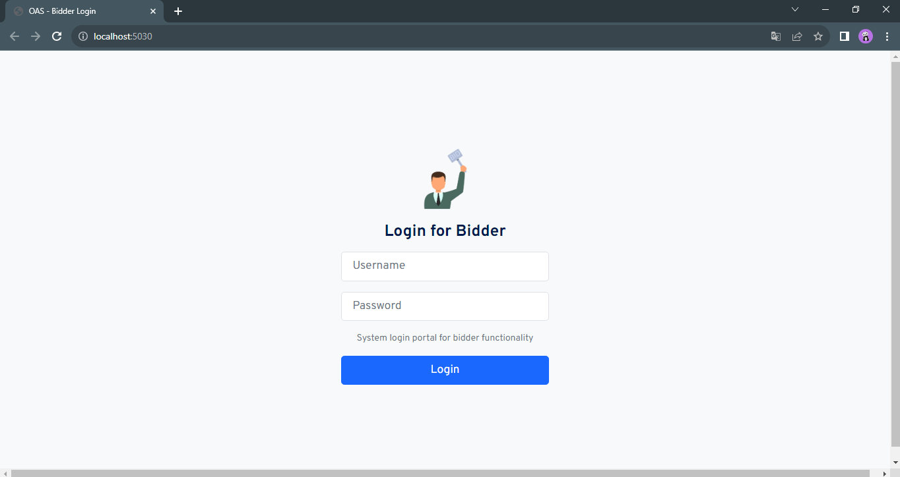 
  <i>Bidder Login</i>

* Auctioneer Login

  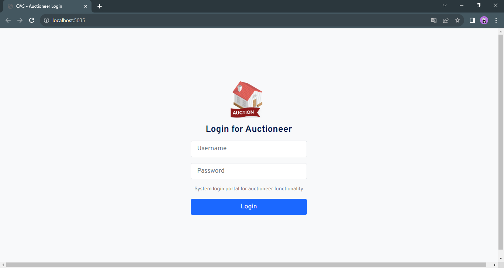 
  <i>Auctioneer Login</i>

* Admin Login

  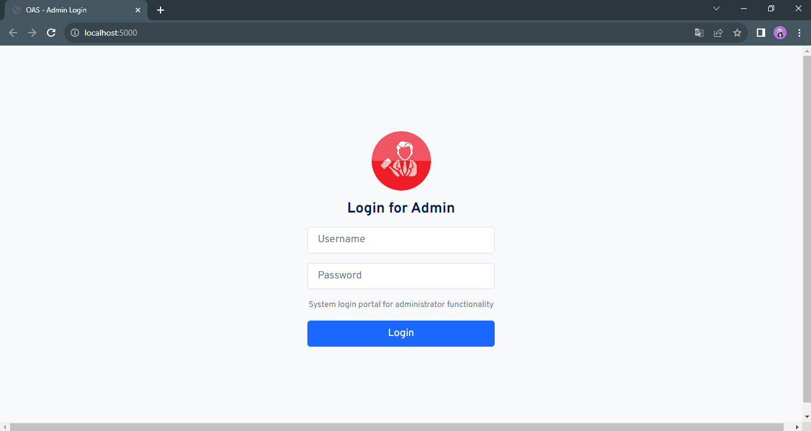 
  <i>Admin Login</i>

(<a href="#readme-top">back to top</a>)

### Demo Home Page
* Auctioneer Home Page

  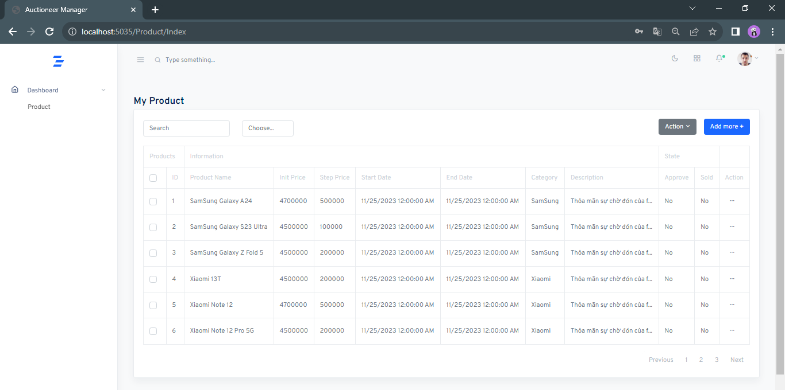 
  <i>Auctioneer Home</i>

* Auctioneer Create, Update Page

  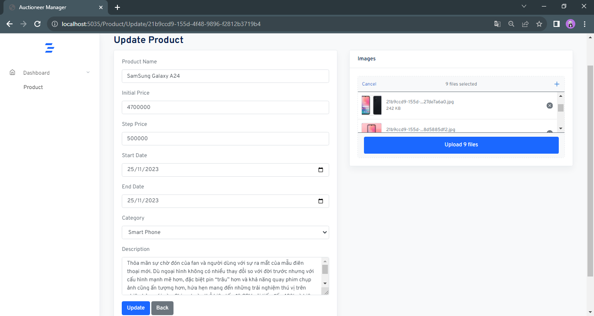 
  <i>Create, Update Page</i>

* Admin Home Page

  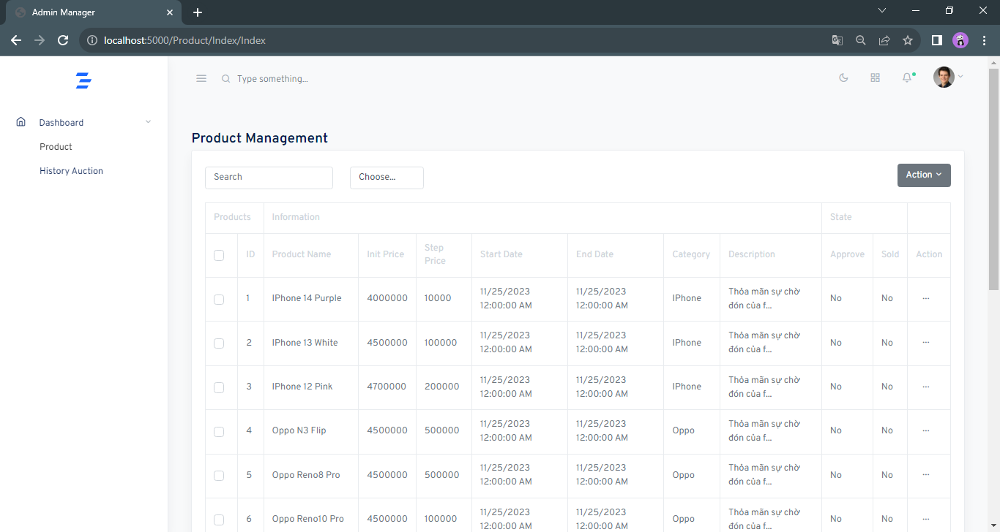 
  <i>Admin Home</i>

(<a href="#readme-top">back to top</a>)

### Demo Approves and Rejects Product
* Admin approves/rejects auction products

  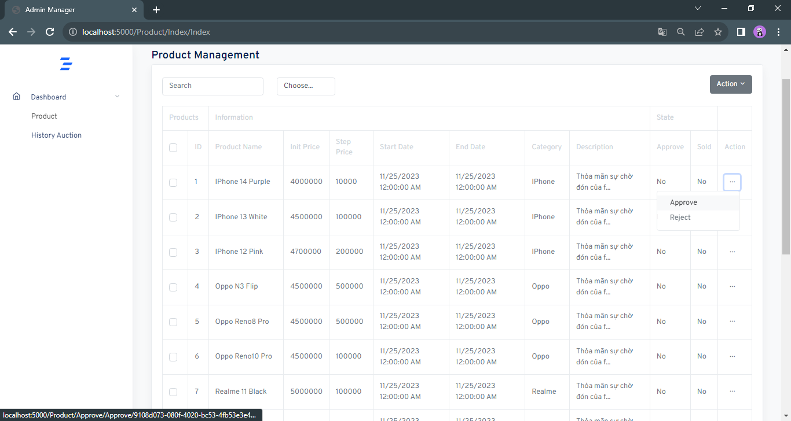 
  <i>Approves/Rejects products</i>

* Admin rejects auction product

  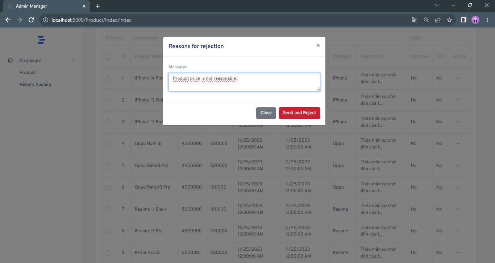 
  <i>Rejects product</i>

* Bidder Home - Displays products with open auctions

  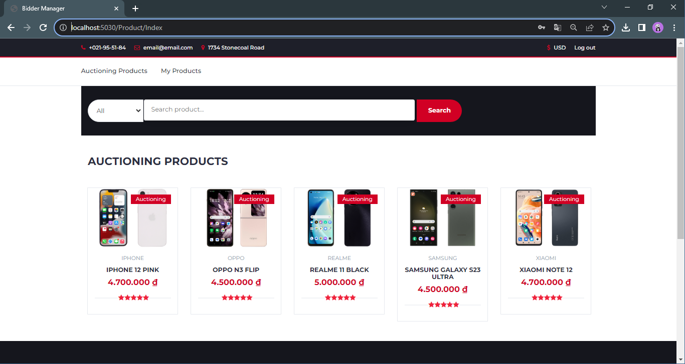 
  <i>Products are being auctioned</i>

(<a href="#readme-top">back to top</a>)

### Demo Product Bidding
* Some auction rules (In the context of the current system):
  * When the admin approves the product posted by Auctioneer, that product will be opened for public auction to everyone.
  * When the auction starts, the product price will be the starting price set by the product owner.
  * For manual auction, the system will calculate the price for the next auction, the user will select the desired option and click Manual Auction.
  * There will be 5 options include:
    * The next price = current price + (step price * 1)
    * The next price = current price + (step price * 2)
    * The next price = current price + (step price * 3)
    * The next price = current price + (step price * 4)
    * The next price = current price + (step price * 5)
    * (These options are just examples, you can change them to suit your intended use).
  * When the bidder's price is equal to the current price, the bidder will not be able to make the auction.
  * The duration of a product's auction will depend on the price of that product. That is, the higher the price of the product, the longer the auction time.
  * When the auction countdown time ends, the system will stop all auction actions.
  * The system will perform processing to determine the product auction winner.
  * All auction participants will receive an email notification of results when the auction ends.
    
* Bidder - Manual auction
  * When the bidder selects the manual auction type, the bidder must conduct the auction himself by pressing the manual auction button.
    

  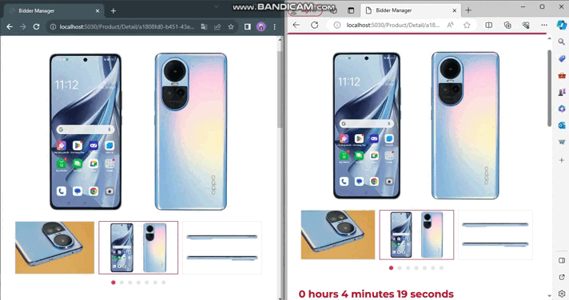 
  <i>Manual auction</i>

* Bidder - Automatic auction
  * Bidders can choose the automatic auction type, the system will automatically increase the price when the bidder's current price is not the highest price.
  * The system only increases the price when the current price + step price < the maximum price the user has set.
  * If the price exceeds the maximum price, the price increase will stop.
    

   
  <i>Automatic auction</i>

* Bidder - My Product interface displays bidder products that have been successfully auctioned (products that have won the auction).

  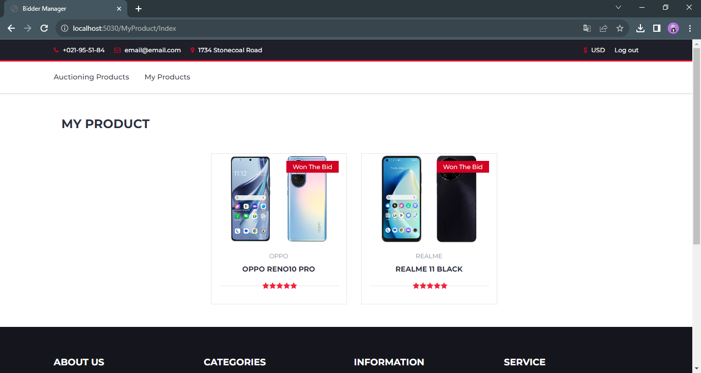 
  <i>The products won the auction</i>

(<a href="#readme-top">back to top</a>)

### Demo Payment
* Bidder - When clicking on the product, detailed information about the product and whether it has been paid will be displayed.

  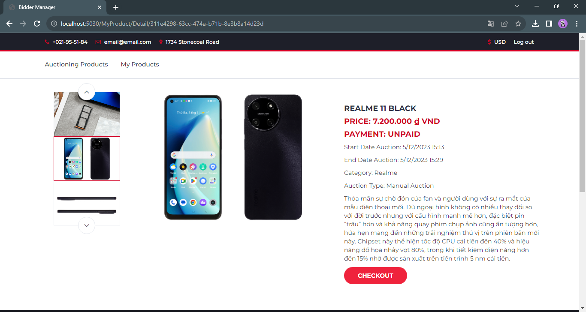 
  <i>Product details</i>

* Bidder - Online payment process, supports many types of online payments including international credit cards, debit cards, QR codes,...

   
  <i>Payment process</i>

(<a href="#readme-top">back to top</a>)

### Demo Search Product
* Bidder - Search for products with open auctions
  * Function to search all products.
  * Search by exact name, search by approximate name.
  * Display search suggestions for products in the system.
  * Display similar products in case the requested product is not found.

  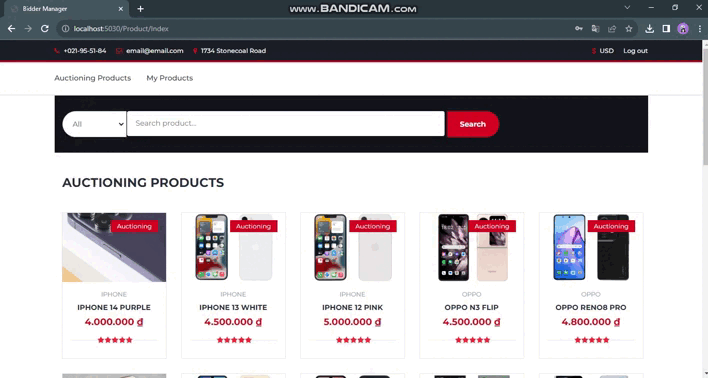 
  <i>Search product</i>

(<a href="#readme-top">back to top</a>)

<!-- LICENSE -->
## License
Distributed under the MIT License. See `LICENSE.txt` for more information.

(<a href="#readme-top">back to top</a>)

