<a name="readme-top"></a>
<!--
*** Thanks for checking out the project. If you have a suggestion that would make this better, please fork the repo and create a pull request
*** Don't forget to give the project a star!
*** Thanks again!
-->
<!-- TABLE OF CONTENTS -->
<details>
  <summary>Table of Contents</summary>
  <ol>
    <li>
      <a href="#about-the-project">About The Project</a>
      <ul>
        <li><a href="#built-with">Built With</a></li>
      </ul>
    </li>
    <li>
      <a href="#getting-started">Getting Started</a>
      <ul>
        <li><a href="#requirements">Requirements</a></li>
        <li><a href="#installation">Installation</a></li>
      </ul>
    </li>
    <li><a href="#usage">Usage</a></li>
    <li><a href="#demo">Demo</a>
      <detail>
        <ul>
          <li><a href="#demo">Demo Login</a></li>
          <li><a href="#demo-home-page">Home Page</a></li>         
          <li><a href="#demo-approves-and-rejects-product">Approves and Rejects Product</a></li>     
          <li><a href="#demo-product-bidding">Product Bidding</a></li>
          <li><a href="#demo-payment">Payment</a></li>
          <li><a href="#demo-search-product">Search product</a></li>
          <li><a href="#demo-email-notifications">Email notifications</a></li>
        </ul>
      </detail></li>
    <li><a href="#deploy-IIS">Deploy IIS</a></li>
    <li><a href="#cicd-with-jenkins">CI/CD with Jenkins</a></li>
    <li><a href="#license">License</a></li>
  </ol>
</details>

<!-- ABOUT THE PROJECT -->
## About The Project
Project: Online Auction System (OAS)<br>
Part 1: Source Code back-end.<br>
**Part 2: Source Code front-end**.<br>
This is the second part of the project.<br>
<br>
The system supports users to participate in online product auctions.<br>
Users can post products for auction.<br>
Users can also participate in product auctions.<br>
After successfully bidding on the product, users can make online payments on the system.

<p align="right">(<a href="#readme-top">back to top</a>)</p>

### Built With
The project is built based on the following frameworks/libraries:
* 
* 
* 
* 
* 
* 
* 
* 
* 
* 
* 
* 
* 
* 
* 
* 

<p align="right">(<a href="#readme-top">back to top</a>)</p>

<!-- GETTING STARTED -->
## Getting Started
The following will be some basic instructions for installing and running the system on a local environment.

### Requirements
Before you continue, ensure you meet the following requirements:
* MS SQL Server, Version = 2022
* dotNet, Version = 6.0
* Redis, Version = 3.0.504
* SignalR, Version = 6.0.21
* Account VNPAY
* AWS IAM Account or Root Account
* Hangfire Core, Version = 1.8.5.0
* Jenkins, Version 2.426.1
* IIS, Version = 10
* Gmail Account
* OS: Windows

<p align="right">(<a href="#readme-top">back to top</a>)</p>

### Installation
I am deploying the system on Docker but it is not yet completed, in the meantime you can install the system and components manually as follows:
* First you need to install dotNet 6.0 or later.
* After installation, next you install MS SQL Server version 2022 or later.
* You can install an IDE to code C# such as Visual Studio or another IDE, my project uses Visual Studio 2022.
* Install Redis version = 3.0.504 or later.
* Install Jenkins version 2.426.1 or later (If you do not need the CICD function, you can skip this step).
* Install IIS (Internet Information Services) version 10 or later (If you do not need deploy in IIS, you can skip this step).
* Next, you can Clone the source code or Download the Zip file project OAS.FE.
* **Note**: This project only contains the front-end source code of the project, if you need the full project, you need to install the OAS.BE project in my github. I have a pin on my github homepage or you can refer to it [**here**](https://github.com/btnhutdev/OAS.BE)
* You also need to customize information such as AWS account, Email Configuration, Connection Strings, JWT Token,... in the following projects:
* Next register an account at VNPAY Payment Gateway. ([**Register**](https://sandbox.vnpayment.vn/devreg) a free account in dev/test environment).  
* You also need to customize information such as AWS account, Email Configuration, Connection Strings, JWT Token,... in the following projects:
  * Admin\appsettings.json file
  * Auctioneer\appsettings.json file
  * Bidder\appsettings.json file
* Install AWS CLI version 2 and log in with your AWS account, making sure your account has permission to access the S3 bucket.
* **Note**: Some of the installation steps you performed when installing the OAS.BE project can be skipped.

<p align="right">(<a href="#readme-top">back to top</a>)</p>

<!-- USAGE -->
## Usage
* Right-click Solution in the Solution Explorer window, select Properties, select Multiple startup projects. Select action start for projects:
  * Admin
  * Auctioneer
  * Bidder
* You can run the project in local by clicking Start in Visual Studio.
* Access the address http://localhost:5000 to enter the Admin interface 
* Access the address http://localhost:5035 to enter the Auctioneer interface
* Access the address http://localhost:5030 to enter the Bidder interface
* **Note**: The ports above are default, you can customize them in the Properties\launchSettings.json file of each project.

<p align="right">(<a href="#readme-top">back to top</a>)</p>

<!-- DEMO -->
## Demo
* Bidder Login - Login interface for bidders who bid to buy products. 
<p align="center">
  <br/>
  <i>Bidder Login</i>
</p>

* Auctioneer Login - Login interface for auctioneer who have products to post for auction.
<p align="center">
  <br/>
  <i>Auctioneer Login</i>
</p>

* Admin Login - Login interface for admins who manage the auction system.
<p align="center">
  <br/>
  <i>Admin Login</i>
</p>

<p align="right">(<a href="#readme-top">back to top</a>)</p>

### Demo Home Page
* Auctioneer Home Page - The interface displays all the auctioneer's own products posted and detailed information.
<p align="center">
  <br/>
  <i>Auctioneer Home</i>
</p>

* Auctioneer Create, Update Page - Auctioneers can create products for auction or update product information.
<p align="center">
  <br/>
  <i>Create, Update Page</i>
</p>

* Admin Home Page - Administrators can view all products available in the system.
<p align="center">
  <br/>
  <i>Admin Home</i>
</p>

<p align="right">(<a href="#readme-top">back to top</a>)</p>

### Demo Approves and Rejects Product
* Admin approves/rejects auction products
* Products need to be approved before the auction can open.
<p align="center">
  <br/>
  <i>Approves/Rejects products</i>
</p>

* Admin rejects auction product
* Rejected products will be flagged as Rejected.
* When refusing, admin need to enter the reason for the refusal, then the product owner will receive a notification email with the reason for the refusal.
<p align="center">
  <br/>
  <i>Rejects product</i>
</p>

* Bidder Home - Displays products with open auctions
<p align="center">
  <br/>
  <i>Products are being auctioned</i>
</p>

<p align="right">(<a href="#readme-top">back to top</a>)</p>

### Demo Product Bidding
* Some auction rules (In the context of the current system):
  * When the admin approves the product posted by Auctioneer, that product will be opened for public auction to everyone.
  * When the auction starts, the product price will be the starting price set by the product owner.
  * For manual auction, the system will calculate the price for the next auction, the user will select the desired option and click Manual Auction.
  * There will be 5 options include:
    * The next price = current price + (step price * 1)
    * The next price = current price + (step price * 2)
    * The next price = current price + (step price * 3)
    * The next price = current price + (step price * 4)
    * The next price = current price + (step price * 5)
    * (These options are just examples, you can change them to suit your intended use).
  * When the bidder's price is equal to the current price, the bidder will not be able to make the auction.
  * The duration of a product's auction will depend on the price of that product. That is, the higher the price of the product, the longer the auction time.
  * When the auction countdown time ends, the system will stop all auction actions.
  * The system will perform processing to determine the product auction winner.
  * All auction participants will receive an email notification of results when the auction ends.
    
* Bidder - Manual auction
  * When the bidder selects the manual auction type, the bidder must conduct the auction himself by pressing the manual auction button.
    
<p align="center">
  <br/>
  <i>Manual auction</i>
</p>

* Bidder - Automatic auction
  * Bidders can choose the automatic auction type, the system will automatically increase the price when the bidder's current price is not the highest price.
  * The system only increases the price when the current price + step price < the maximum price the user has set.
  * If the price exceeds the maximum price, the price increase will stop.
    
<p align="center">
  <br/>
  <i>Automatic auction</i>
</p>

* Bidder - My Product interface displays bidder products that have been successfully auctioned (products that have won the auction).
<p align="center">
  <br/>
  <i>The products won the auction</i>
</p>

<p align="right">(<a href="#readme-top">back to top</a>)</p>

### Demo Payment
* Bidder - When clicking on the product, detailed information about the product and whether it has been paid will be displayed.
<p align="center">
  <br/>
  <i>Product details</i>
</p>

* Bidder - Online payment process, supports many types of online payments including international credit cards, debit cards, QR codes,...
<p align="center">
  <br/>
  <i>Payment process</i>
</p>

<p align="right">(<a href="#readme-top">back to top</a>)</p>

### Demo Search Product
* Bidder - Search for products with open auctions
  * Function to search all products.
  * Search by exact name, search by approximate name.
  * Display search suggestions for products in the system.
  * Display similar products in case the requested product is not found.
<p align="center">
  <br/>
  <i>Search product</i>
</p>

<p align="right">(<a href="#readme-top">back to top</a>)</p>

### Demo Email Notifications
* Email notifying that the product has been approved
<p align="center">
  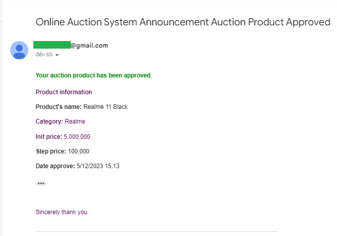<br/>
  <i>Approved Product</i>
</p>

* Email notifying that the product has been Rejected
<p align="center">
  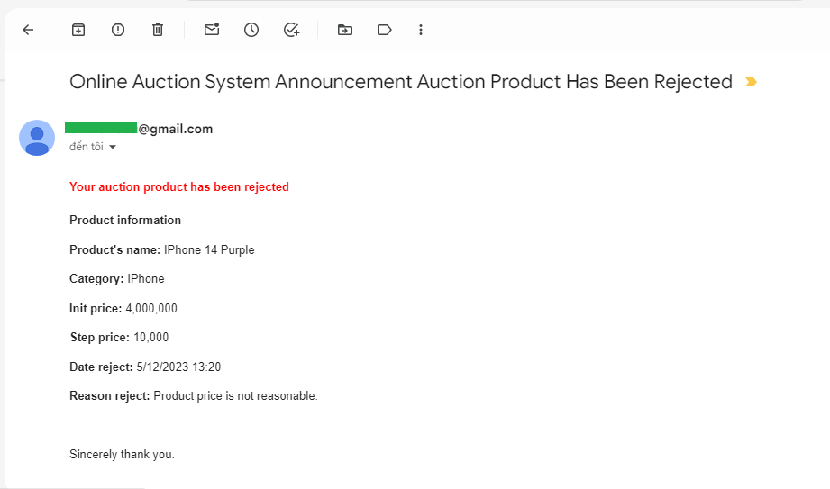<br/>
  <i>Rejected Product</i>
</p>

* Email notification of successful product auction
<p align="center">
  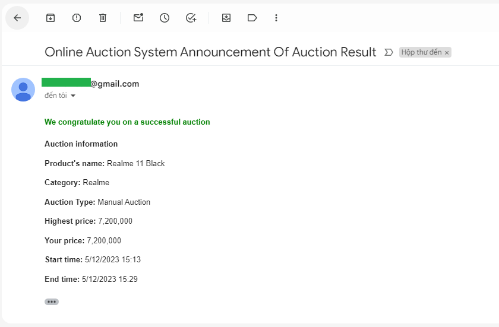<br/>
  <i>Successful product auction</i>
</p>

* Email notification of failed product auction
<p align="center">
  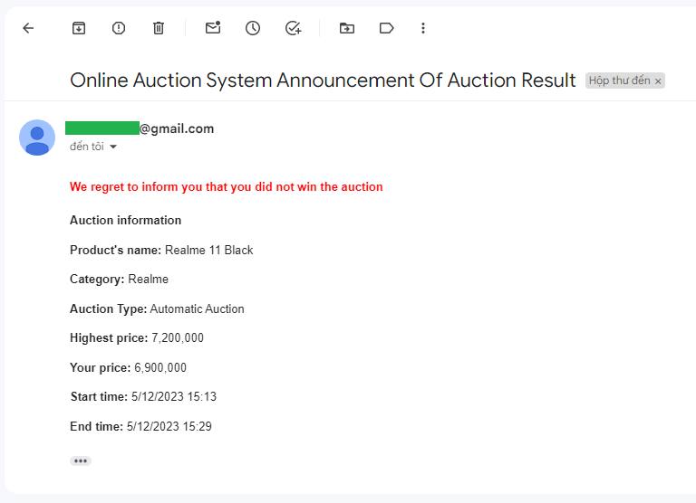<br/>
  <i>Failed product auction</i>
</p>

* Email notification of successful payment for auction product order
<p align="center">
  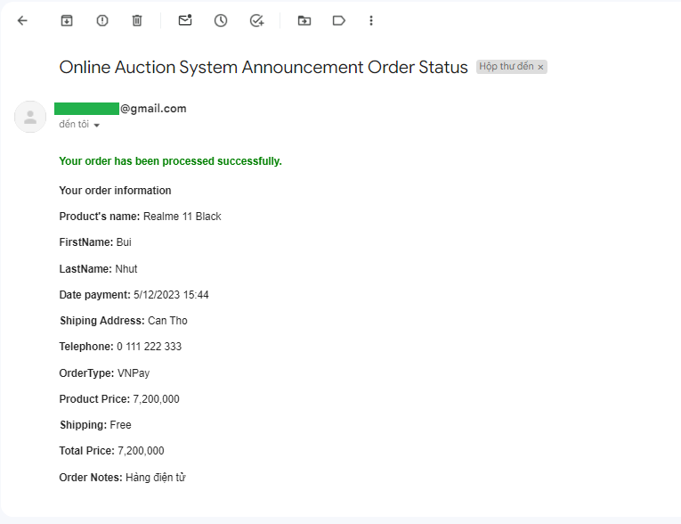<br/>
  <i>Successful payment order</i>
</p>

* Mail notifying that the product has been successfully sold to the product owner who has posted the product for auction.
<p align="center">
  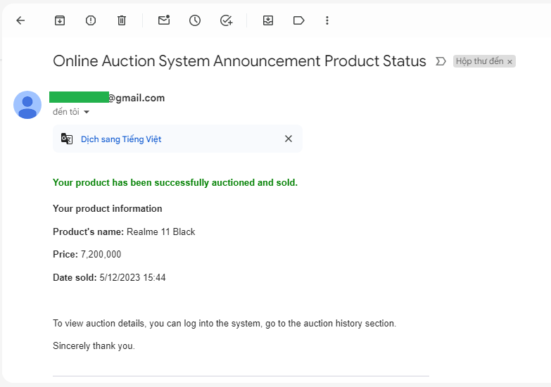<br/>
  <i>Sold Success</i>
</p>

<p align="right">(<a href="#readme-top">back to top</a>)</p>

## Deploy IIS
* Next, we deploy the system on the local IIS server. I am created 4 websites to deploy the system:
  * Website contains back-end source code
  * Website contains Admin source code
  * Website contains Auctioneer source code
  * Website contains Bidder source code
* Deploy back-end source code on IIS
* Physical Path will be in the C:\inetpub\wwwroot\your path
<p align="center">
  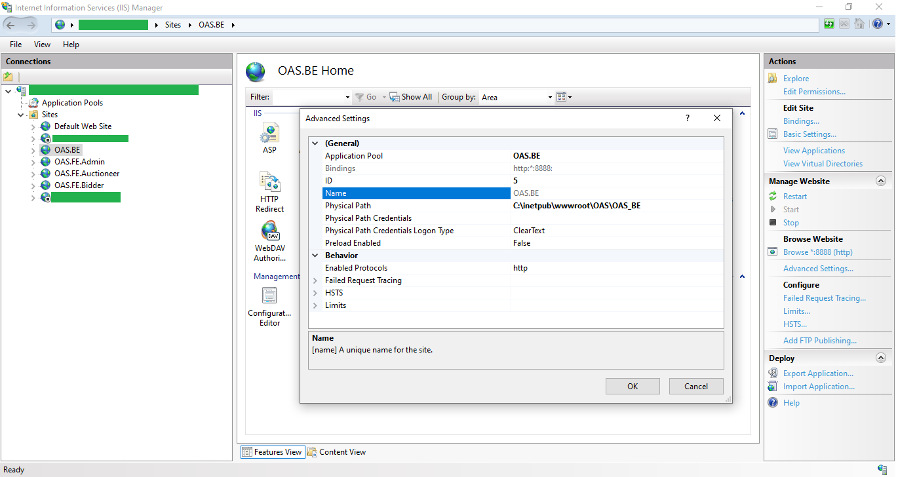<br/>
  <i>Deploy back-end source code on IIS</i>
</p>

* Deploy admin source code on IIS
* Physical Path will be in the C:\inetpub\wwwroot\your path
<p align="center">
  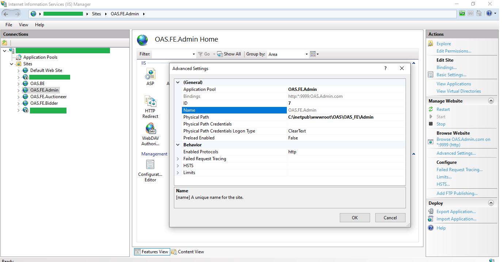<br/>
  <i>Deploy admin source code on IIS</i>
</p>

* Deploy auctioneer source code on IIS
* Physical Path will be in the C:\inetpub\wwwroot\your path
<p align="center">
  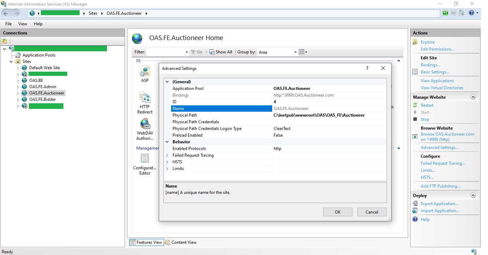<br/>
  <i>Deploy auctioneer source code on IIS</i>
</p>

* Deploy bidder source code on IIS
* Physical Path will be in the C:\inetpub\wwwroot\your path
<p align="center">
  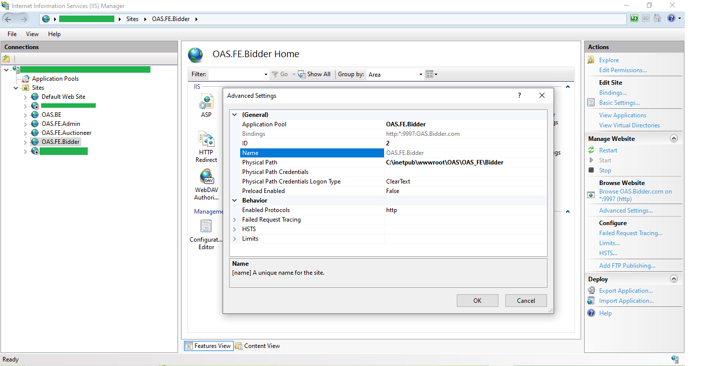<br/>
  <i>Deploy bidder source code on IIS</i>
</p>

<p align="right">(<a href="#readme-top">back to top</a>)</p>

## CICD with jenkins
* I am also created 4 Pipeline projects in jenkins to conveniently deploy CICD source code on the IIS server.
* Each jenkins project will deploy code to a website on IIS created in the previous step.
* I will guide you to create a project in jenkins, other projects will also be created and configured similarly.
  * After you have installed Jenkins, log in to jenkins.
  * In the Manage Jenkins tab, select Plugins, in the Available plugins tab, install necessary plugins to work with .NET and GitHub.
  * Create one Credential in Dashboard/Manage Jenkins/Credentials
  * After created the credential. Next create a new project in the New Item tab, select Pipeline Project, enter a Project name and click OK.
  * Then go to Project/Configure:
  * Check GitHub hook trigger for GITScm polling
  * Check Poll SCM and enter * * * * * in the Schedule box
<p align="center">
  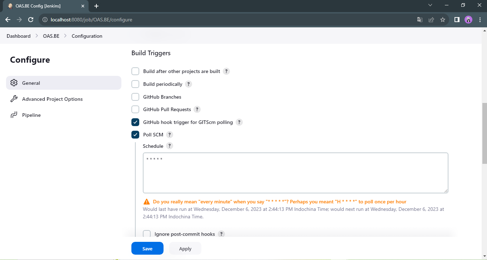<br/>
  <i>Configure Jenkins</i>
</p>
  * In the Pipeline section, enter the source code in the Script box
 <br>
 
  ```Groovy
  pipeline {  
   agent any  
   environment {  
    dotnet = 'C:\\Program Files\\dotnet\\dotnet.exe'  
   }  
   
   stages {  
    stage('Checkout Stage') {  
     steps {
         // replace your credential here
         git credentialsId: 'replace your credential here', url: 'https://github.com/btnhutdev/OAS.BE.git', branch: 'master'
     }  
    } 
    
   stage('Build Stage') {  
     steps {  
  	bat 'dotnet build OAS_BE.sln --configuration Release /p:OutputPath="C:\\inetpub\\wwwroot\\OAS\\OAS_BE"'
      }  
    }   
    
    stage('Test Stage') {
      steps {
              bat 'dotnet test .\\src\\ApiGateway\\ApiGateway.csproj'
              bat 'dotnet test .\\src\\Core\\Core.csproj'
              bat 'dotnet test .\\src\\Domain\\Domain.csproj'
              bat 'dotnet test .\\src\\Infrastructure\\Infrastructure.csproj'
              bat 'dotnet test .\\src\\Payment.API\\Payment.API.csproj'
              bat 'dotnet test .\\src\\Product.API\\Product.API.csproj'
              bat 'dotnet test .\\src\\Search.API\\Search.API.csproj'
              bat 'dotnet test .\\src\\Authen.API\\Authen.API.csproj'
          }
      }
          
    stage("Release Stage"){
      steps {
              bat 'dotnet build .\\src\\ApiGateway\\ApiGateway.csproj /p:Platform="Any CPU" /p:DeployOnBuild=true /m /p:OutputPath=C:\\inetpub\\wwwroot\\OAS\\OAS_BE /p:PublishProfile=".\\src\\ApiGateway\\Properties\\PublishProfiles\\ApiGatewayProfile.pubxml"'
              bat 'dotnet build .\\src\\Authen.API\\Authen.API.csproj /p:Platform="Any CPU" /p:DeployOnBuild=true /m /p:OutputPath=C:\\inetpub\\wwwroot\\OAS\\OAS_BE /p:PublishProfile=".\\src\\Authen.API\\Properties\\PublishProfiles\\AuthenAPIProfile.pubxml"'
              bat 'dotnet build .\\src\\Core\\Core.csproj /p:Platform="Any CPU" /p:DeployOnBuild=true /m /p:OutputPath=C:\\inetpub\\wwwroot\\OAS\\OAS_BE /p:PublishProfile=".\\src\\Core\\Properties\\PublishProfiles\\CoreProfile.pubxml"'
              bat 'dotnet build .\\src\\Domain\\Domain.csproj /p:Platform="Any CPU" /p:DeployOnBuild=true /m /p:OutputPath=C:\\inetpub\\wwwroot\\OAS\\OAS_BE /p:PublishProfile=".\\src\\Domain\\Properties\\PublishProfiles\\DomainProfile.pubxml"'
              bat 'dotnet build .\\src\\Infrastructure\\Infrastructure.csproj /p:Platform="Any CPU" /p:DeployOnBuild=true /m /p:OutputPath=C:\\inetpub\\wwwroot\\OAS\\OAS_BE /p:PublishProfile=".\\src\\Infrastructure\\Properties\\PublishProfiles\\InfrastructureProfile.pubxml"'    
              bat 'dotnet build .\\src\\Payment.API\\Payment.API.csproj /p:Platform="Any CPU" /p:DeployOnBuild=true /m /p:OutputPath=C:\\inetpub\\wwwroot\\OAS\\OAS_BE /p:PublishProfile=".\\src\\Payment.API\\Properties\\PublishProfiles\\PaymentAPIProfile.pubxml"'  
              bat 'dotnet build .\\src\\Product.API\\Product.API.csproj /p:Platform="Any CPU" /p:DeployOnBuild=true /m /p:OutputPath=C:\\inetpub\\wwwroot\\OAS\\OAS_BE /p:PublishProfile=".\\src\\Product.API\\Properties\\PublishProfiles\\ProductAPIProfile.pubxml"'  
              bat 'dotnet build .\\src\\Search.API\\Search.API.csproj /p:Platform="Any CPU" /p:DeployOnBuild=true /m /p:OutputPath=C:\\inetpub\\wwwroot\\OAS\\OAS_BE /p:PublishProfile=".\\src\\Search.API\\Properties\\PublishProfiles\\SearchAPIProfile.pubxml"'
          }   
      }
    
      stage('Deploy Stage') {
        steps {
          // Deploy package to IIS
          bat '"C:\\Program Files (x86)\\IIS\\Microsoft Web Deploy V3\\msdeploy.exe" -verb:sync -dest:auto -source:package="C:\\inetpub\\wwwroot\\OAS\\OAS_BE\\ApiGateway.zip" -setParam:"IIS Web Application Name"="OAS.BE" -skip:objectName=filePath,absolutePath=".\\\\PackageTmp\\\\Web.config$" -enableRule:DoNotDelete -allowUntrusted=true'
          bat '"C:\\Program Files (x86)\\IIS\\Microsoft Web Deploy V3\\msdeploy.exe" -verb:sync -dest:auto -source:package="C:\\inetpub\\wwwroot\\OAS\\OAS_BE\\Authen.API.zip" -setParam:"IIS Web Application Name"="OAS.BE" -skip:objectName=filePath,absolutePath=".\\\\PackageTmp\\\\Web.config$" -enableRule:DoNotDelete -allowUntrusted=true'    
          bat '"C:\\Program Files (x86)\\IIS\\Microsoft Web Deploy V3\\msdeploy.exe" -verb:sync -dest:auto -source:package="C:\\inetpub\\wwwroot\\OAS\\OAS_BE\\Payment.API.zip" -setParam:"IIS Web Application Name"="OAS.BE" -skip:objectName=filePath,absolutePath=".\\\\PackageTmp\\\\Web.config$" -enableRule:DoNotDelete -allowUntrusted=true'    
          bat '"C:\\Program Files (x86)\\IIS\\Microsoft Web Deploy V3\\msdeploy.exe" -verb:sync -dest:auto -source:package="C:\\inetpub\\wwwroot\\OAS\\OAS_BE\\Product.API.zip" -setParam:"IIS Web Application Name"="OAS.BE" -skip:objectName=filePath,absolutePath=".\\\\PackageTmp\\\\Web.config$" -enableRule:DoNotDelete -allowUntrusted=true'    
          bat '"C:\\Program Files (x86)\\IIS\\Microsoft Web Deploy V3\\msdeploy.exe" -verb:sync -dest:auto -source:package="C:\\inetpub\\wwwroot\\OAS\\OAS_BE\\Search.API.zip" -setParam:"IIS Web Application Name"="OAS.BE" -skip:objectName=filePath,absolutePath=".\\\\PackageTmp\\\\Web.config$" -enableRule:DoNotDelete -allowUntrusted=true'
        }
      }
   }  
  }  
  ```
  * Configure Script Pipeline
  <p align="center">
    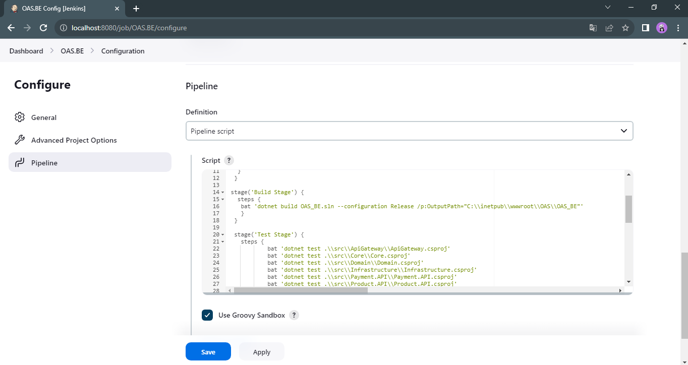<br/>
    <i>Configure Jenkins</i>
  </p>
  
  * Click Apply and click Save
  * Then click build now or when the source code on github has a commit, the build process will begin.
  * Below are some demo.

<p align="center">
  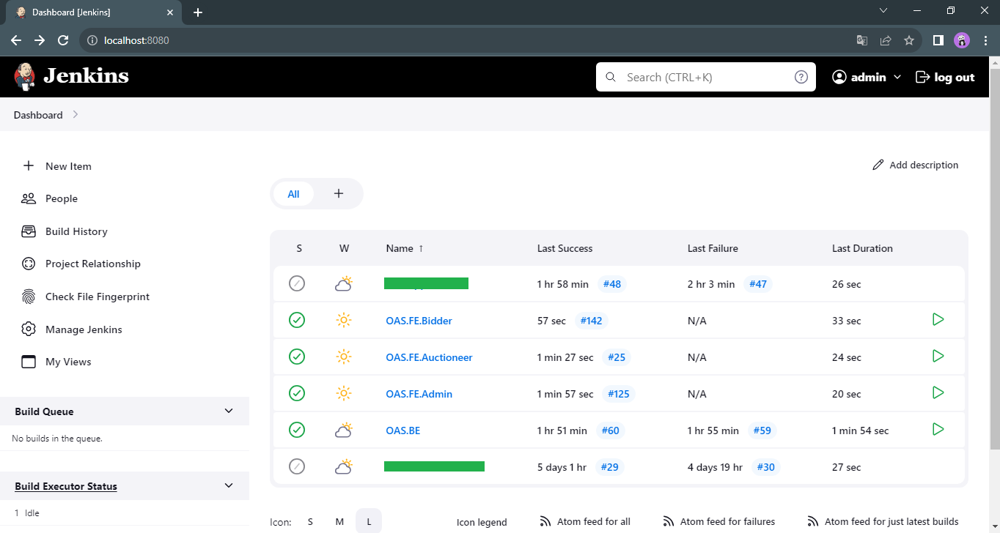<br/>
  <i>Jenkins home page</i>
</p>
<p align="center">
  <br/>
  <i>Back-end project</i>
</p>
<p align="center">
  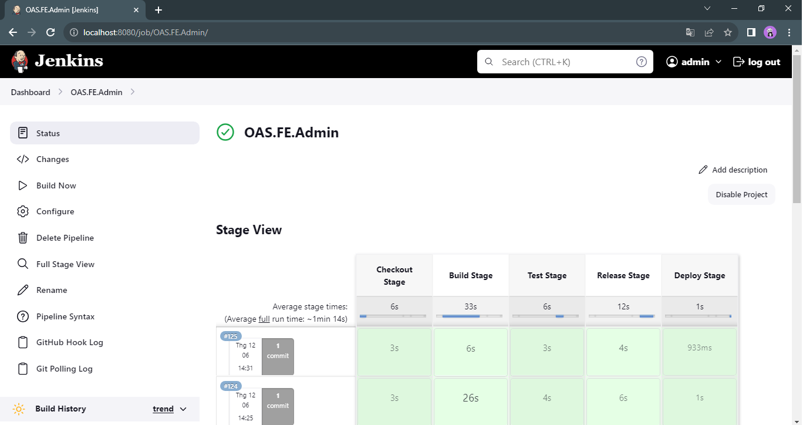<br/>
  <i>Admin project</i>
</p>
<p align="center">
  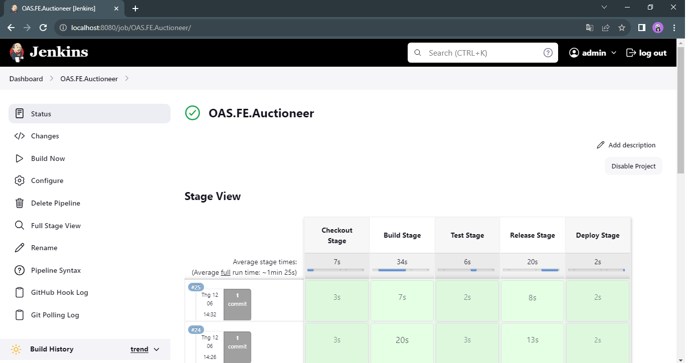<br/>
  <i>Auctioneer project</i>
</p>
<p align="center">
  <br/>
  <i>Bidder project</i>
</p>

* Click Apply and click Save
* After the settings have been completed.
* When the code on github changes (master branch or any other branch specified).
* Jenkins will automatically pull to local following the path: C:\ProgramData\Jenkins\.jenkins\workspace
* Jenkins will then execute other commands such as build, test and finally deploy to the IIS server directory C:\inetpub\wwwroot
<br>

**Note**: You can customize the local directory where Jenkins will pull code, build code,... You can also specify a deploy folder other than C:\inetpub\wwwroot.

<p align="right">(<a href="#readme-top">back to top</a>)</p>
  
<!-- LICENSE -->
## License
Distributed under the MIT License. See `LICENSE.txt` for more information.

<p align="right">(<a href="#readme-top">back to top</a>)</p>
